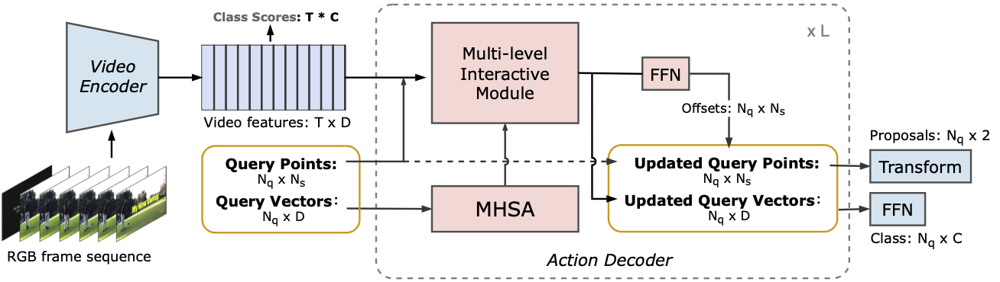
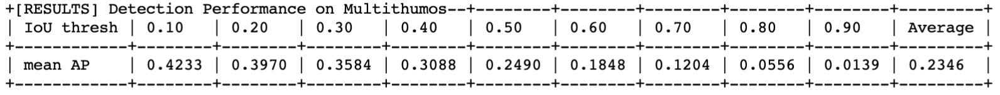
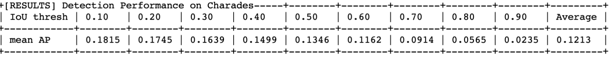

# PointTAD [NeurIPS 2022]

This repo holds the codes of paper: "PointTAD: Multi-Label Temporal Action Detection with Learnable Query Points", which is accepted in NeurIPS 2022.



[[Paper Link](https://openreview.net/pdf?id=_r8pCrHwq39)] [[Zhihu](https://zhuanlan.zhihu.com/p/591495791)]

## News

**[Jan. 10, 2023]** Fixed some bugs and typos; updated best checkpoints for both multi-label benchmarks.

**[Dec. 13, 2022]**  We release the codes and checkpoints on MultiTHUMOS and Charades.

## Overview

This paper presents a query-based framework for multi-label temporal action detection, namely PointTAD, that leverages a set of **learnable query points** to handle both boundary frames and action semantic keyframes for finer action representation. Our model takes **RGB input only** and streamlines an **end-to-end trainable** framework for easy deployment. PointTAD surpasses previous multi-label TAD works by a large margin under detection-mAP and achieves comparable results under segmentation-mAP.

- [Dependencies](#dependencies)
- [Data Preparation](#data-preparation)
- [Checkpoints](#checkpoints)
- [Testing](#testing)
- [Training](#training)

## Dependencies

PyTorch 1.8.1 or higher, opencv-python, scipy, terminaltables, ruamel-yaml, **ffmpeg**

`pip install -r requirements.txt` to install dependencies.

## Data Preparation

To prepare the RGB frames and corresponding annotations,

- Clone the repository and `cd PointTAD; mkdir data` 
- For **MultiTHUMOS:** 
  - Download the raw videos of THUMOS14 from [here](https://mycuhk-my.sharepoint.com/:f:/g/personal/1155208004_link_cuhk_edu_hk/EnTL-cAp4h1FlsqdQrzRxhwB7q9O1z9vqFaaL1WpdDWv-w) and put them into `/data/thumos14_videos`;
  - Extract the RGB frames from raw videos using  `utils/extract_frames.py`.  The frames will be placed in `/data/multithumos_frames`;
  - You also need to generate `multithumos_frames.json` for the extracted frames with  `/util/generate_frame_dict.py` and put the json file into `/dataset` folder.
- For **Charades:** 
  - Download the RGB frames of Charades from [here](https://prior.allenai.org/projects/charades) , and place the frames at  `/data/charades_v1_rgb`.

- Replace the frame folder path or image tensor path in `/data/dataset_cfg.yml`.

The structure of `data/` is displayed as follows:

```
|-- data
|   |-- thumos14_videos
|   |   |-- training
|   |   |-- testing
|   |-- multithumos_frames
|   |   |-- training
|   |   |-- testing
|   |-- charades_v1_rgb
```

**[Optional]** Once you had the raw frames, you can convert them into tensors with `/util/frames2tensor.py` to **speed up IO**. By enabling  `--img_tensor` in `train.sh` and `test.sh`, the model takes in image tensors instead of frames.

## Checkpoints

The best checkpoint is provided in the link below. We provide an error bar for each benchmark in the supplementary material of our paper.

| Dataset         | mAP@0.2 | mAP@0.5 | mAP@0.7 | Avg-mAP | Checkpoint                                                   |
| --------------- | ------- | ------- | ------- | ------- | ------------------------------------------------------------ |
| **MultiTHUMOS** | 39.70%  | 24.90%  | 12.04%  | 23.46%  | [Link](https://drive.google.com/file/d/1GhaxMOpknRlidENIsJIZ3Cl_o_vcGnoH/view?usp=sharing) |
| **Charades**    | 17.45%  | 13.46%  | 9.14%   | 12.13%  | [Link](https://drive.google.com/file/d/1NDogh-us8GQ1kYA-eSR-yjN3MksH4USG/view?usp=sharing) |





## Testing

Use `test.sh` to evaluate,

- **MultiTHUMOS**:  

```
CUDA_VISIBLE_DEVICES=0,1,2,3,4,5,6,7 python -m torch.distributed.launch --nproc_per_node=8 --master_port=11302 --use_env main.py --dataset multithumos --eval --load multithumos_best.pth
```

- **Charades**:

```
CUDA_VISIBLE_DEVICES=0,1,2,3,4,5,6,7 python -m torch.distributed.launch --nproc_per_node=8 --master_port=11302 --use_env main.py --dataset charades --eval --load charades_best.pth
```

## Training 

Use `train.sh` to train PointTAD,

- **MultiTHUMOS**:

`````````
CUDA_VISIBLE_DEVICES=0,1,2,3,4,5,6,7 python -m torch.distributed.launch --nproc_per_node=8 --master_port=11302 --use_env main.py --dataset multithumos
`````````

- **Charades**:

````
CUDA_VISIBLE_DEVICES=0,1,2,3,4,5,6,7 python -m torch.distributed.launch --nproc_per_node=8 --master_port=11302 --use_env main.py --dataset charades
````

## Acknowledgements

The codebase is built on top of [RTD-Net](https://github.com/MCG-NJU/RTD-Action), [DETR](https://github.com/facebookresearch/detr), [Sparse R-CNN](https://github.com/PeizeSun/SparseR-CNN), [AFSD](https://github.com/TencentYoutuResearch/ActionDetection-AFSD/) and [E2ETAD](https://github.com/xlliu7/E2E-TAD), we thank them for providing useful codes.

## Citations

If you think our work is useful, please feel free to cite our paper:

```
@inproceedings{
	tan2022pointtad,
	title={Point{TAD}: Multi-Label Temporal Action Detection with Learnable Query Points},
	author={Jing Tan and Xiaotong Zhao and Xintian Shi and Bin Kang and Limin Wang},
	booktitle={Advances in Neural Information Processing Systems},
	editor={Alice H. Oh and Alekh Agarwal and Danielle Belgrave and Kyunghyun Cho},
	year={2022},
	url={https://openreview.net/forum?id=_r8pCrHwq39}
}
```

## Contacts

Jing Tan: jtan@smail.nju.edu.cn
